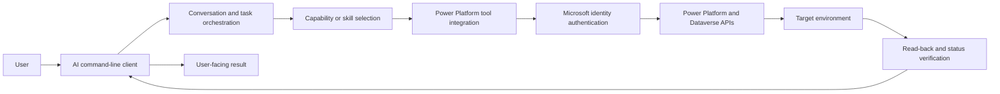
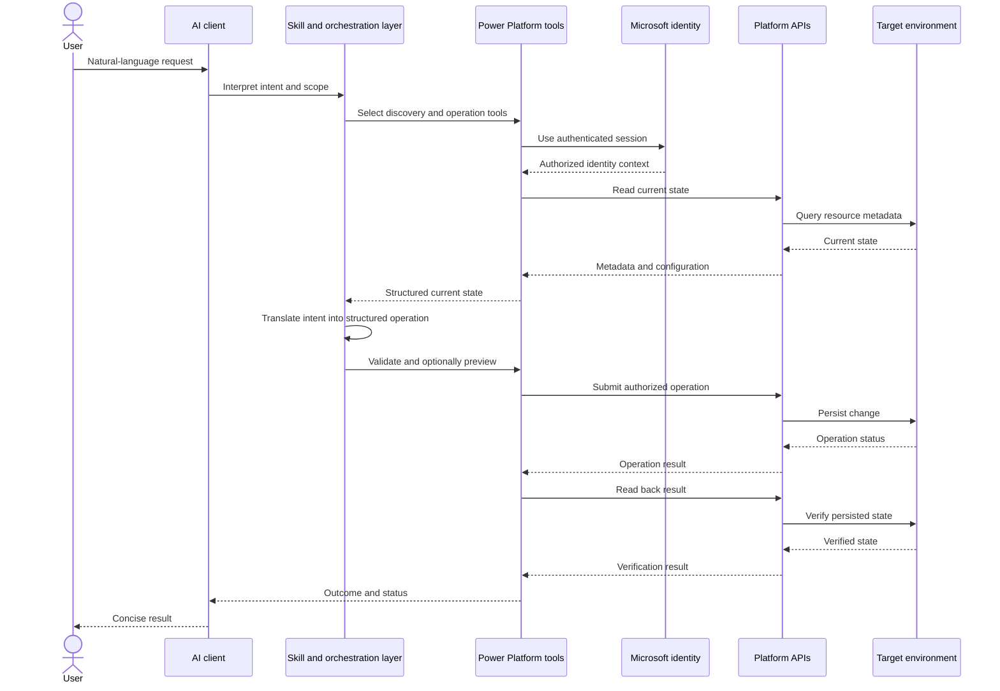
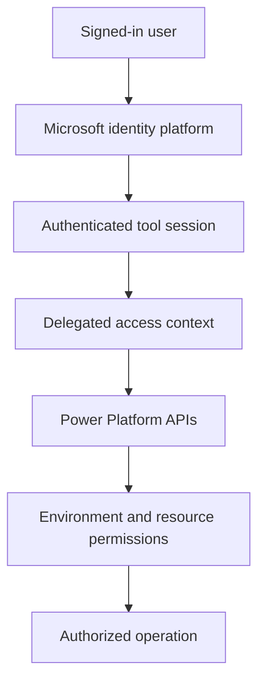
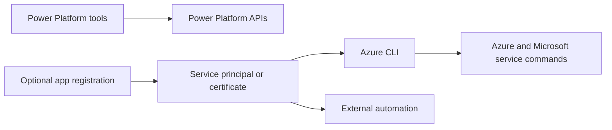
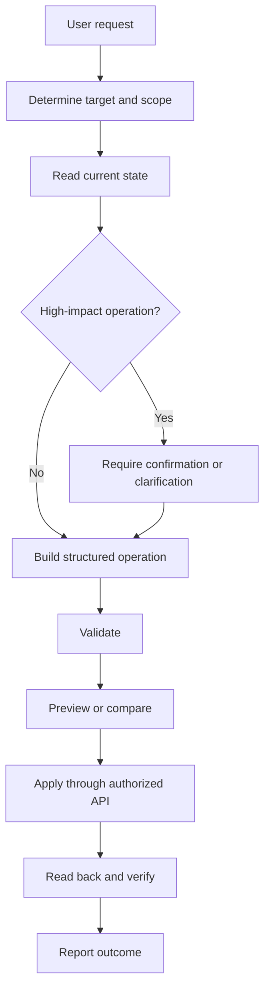
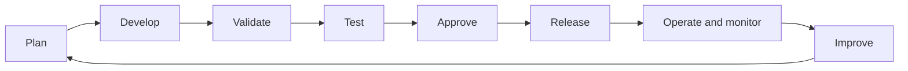

Create a professional PowerPoint presentation titled:

**Power Automate 101**

Subtitle:
**Automate repetitive work. Connect systems. Build smarter business processes.**

Audience: Four team members who are complete beginners to Microsoft Power Automate, Power Apps, SharePoint, and Dataverse.

Session length: **50 minutes**

The purpose of this presentation is to give beginners a high-level understanding of Power Automate, the business problems it solves, and the basic concepts they need before they start building flows.

Keep the presentation beginner-friendly, visual, modern, and easy to understand. Do not make the slides overly technical or text-heavy. Use Microsoft Power Platform-style visuals, icons, process diagrams, arrows, and simple flow diagrams wherever appropriate.

Use approximately **16–18 slides**.

Organize the presentation as follows:

### Slide 1 – Power Automate 101

Title: Power Automate 101

Subtitle:
Automate repetitive work. Connect systems. Build smarter business processes.

Beginner Training | 50 Minutes

---

### Slide 2 – Today's Goal

By the end of this session, participants should understand:

* What Power Automate is
* Why businesses use automation
* What kinds of business problems Power Automate can solve
* Triggers, actions, conditions, and dynamic content
* Automated, Instant, and Scheduled flows
* How Power Automate works with SharePoint, Dataverse, Power Apps, Teams, and Outlook

Emphasize that no previous Power Automate experience is required.

---

### Slide 3 – Before Power Automate

Show a manual business process visually:

Employee submits request
→ Someone checks the request
→ Someone emails the manager
→ Manager approves or rejects
→ Someone updates the request
→ Someone notifies the employee

Highlight the problems:

* Repetitive manual work
* Time consuming
* Easy to miss steps
* Dependent on people remembering what to do

Use a process diagram rather than lots of text.

---

### Slide 4 – What If We Automated It?

Transform the previous process into:

Employee submits request
→ Power Automate starts automatically
→ Manager receives approval
→ Manager approves/rejects
→ Request status updates automatically
→ Employee receives notification

Highlight the reduction in manual work.

---

### Slide 5 – What Is Power Automate?

Explain simply:

**Power Automate is Microsoft's workflow automation platform that connects applications and services to automate business processes.**

Emphasize this simple mental model:

**WHEN something happens → DO something automatically**

Examples:

New SharePoint item → Send notification

Request submitted → Start approval

Every morning → Find overdue tasks → Send reminders

---

### Slide 6 – What Can Power Automate Do?

Use icons or visual cards for:

* Notifications
* Approvals
* Reminders
* Data movement
* Data updates
* Document automation
* Scheduled processes
* Application/system integrations

Keep explanations very short.

---

### Slide 7 – Real-World Business Examples

Show four simple examples:

**Employee Onboarding**
New employee → Notify IT → Create tasks → Notify manager

**Expense Approval**
Expense submitted → Manager approval → Update status → Notify employee

**Overdue Tasks**
Every morning → Find overdue tasks → Send reminders

**Document Approval**
Document uploaded → Review → Approve/Reject → Update or move document

---

### Slide 8 – The Most Important Concept

Make this the central visual:

**TRIGGER → ACTION**

Explain:

**Trigger = What starts the flow?**

Examples:

* SharePoint item created
* Dataverse row added
* Email received
* User clicks a button
* Scheduled time occurs

**Action = What should Power Automate do?**

Examples:

* Send email
* Update record
* Create file
* Post Teams message
* Start approval

---

### Slide 9 – Adding Business Logic

Introduce conditions visually.

Show:

Request Submitted
↓
Check Amount
↓
**Amount > $5,000?**

YES → Manager Approval

NO → Auto Approve

Explain that a **Condition** allows Power Automate to make decisions and follow different paths.

---

### Slide 10 – Four Concepts to Remember

Create four large visual cards:

**1. Trigger**
What starts the flow?

**2. Action**
What should happen?

**3. Condition**
Which path should the flow follow?

**4. Dynamic Content**
Information coming from previous steps.

Emphasize that these four concepts form the foundation of Power Automate.

---

### Slide 11 – What Is Dynamic Content?

Use this example:

Employee: John Smith
Request: Laptop
Amount: $1,500

Instead of hardcoding:

"John Smith requested a Laptop"

Power Automate can dynamically create:

"[Employee Name] requested a [Request Type]"

Explain that values from SharePoint, Dataverse, forms, emails, or previous actions can be reused later in the flow.

---

### Slide 12 – Three Common Types of Flows

Create three visual sections.

**Automated Flow**
Starts when something happens.

Example:
New SharePoint item → Send notification

**Instant Flow**
Starts when a user manually triggers it.

Example:
User clicks button → Start process

**Scheduled Flow**
Runs based on time.

Example:
Every morning at 8 AM → Find overdue requests → Send reminders

---

### Slide 13 – Power Automate Connects Systems

Put **Power Automate** in the center.

Around it show:

* SharePoint
* Dataverse
* Power Apps
* Outlook
* Microsoft Teams
* Approvals

Connect them visually to Power Automate.

Explain that Power Automate uses **connectors** to communicate with different applications and services.

---

### Slide 14 – The Power Platform Picture

Create a simple architecture diagram:

**Power Apps**
User Interface

↓

**SharePoint / Dataverse**
Data

↓

**Power Automate**
Business Process / Automation

Then show an example:

User clicks Submit in Power Apps
→ Request saved
→ Power Automate starts
→ Manager approval
→ Status updated
→ User notified

Keep this very high level.

---

### Slide 15 – Live Demo: Equipment Request Approval

This slide introduces the live demonstration.

Show this flow visually:

Employee submits equipment request
↓
SharePoint item created
↓
Power Automate starts
↓
Manager receives approval
↓
Approved?

YES → Update Status = Approved → Notify Employee

NO → Update Status = Rejected → Notify Employee

Add a clear label:

**LIVE DEMO**

Do not overcrowd this slide because the actual flow will be demonstrated live.

---

### Slide 16 – Let's Design One Together

Present this requirement:

**"Every morning, find requests that are still pending and remind the request owners."**

Ask the audience:

1. What starts the flow?
2. Where is our data?
3. What condition are we checking?
4. What should happen?

Then reveal the solution visually:

**Schedule → Get SharePoint Items → Check Status → Send Reminder**

Make this an interactive discussion slide.

---

### Slide 17 – How to Think Like a Flow Developer

Before opening Power Automate, ask:

1. What is the business problem?
2. What starts the process?
3. What information do I need?
4. Are there any decisions?
5. What actions need to happen?
6. Where should the result be stored?

Highlight this principle:

**Design the process first. Build the flow second.**

---

### Slide 18 – Key Takeaway + Q&A

Large central message:

**TRIGGER → ACTION → DECISION → ACTION**

Then:

Power Automate helps automate business processes that are:

* Repetitive
* Rule-based
* Manual
* Time-consuming
* Easy to forget

End with:

**Questions?**

Add a small "What's Next?" section:

Next session:
**Hands-on Power Automate: Triggers, Actions, Conditions, and SharePoint**

---

### Presentation Style

Use a clean, modern corporate Microsoft-style design.

Use Power Automate purple/blue visual styling where appropriate, but keep the overall presentation professional.

Prefer diagrams, arrows, icons, cards, and flow visuals over paragraphs.

Keep each slide easy to understand within a few seconds.

Do not overload slides with text.

Use consistent typography and spacing throughout.

Where appropriate, use recognizable Microsoft-style icons for Power Automate, Power Apps, SharePoint, Dataverse, Teams, and Outlook.

The audience is completely new to Power Platform, so avoid unexplained technical terminology.

### Timing

Design the presentation around this 50-minute schedule:

* 0–5 minutes: Introduction and business problem
* 5–10 minutes: What Power Automate is and what it can solve
* 10–20 minutes: Triggers, actions, conditions, dynamic content, and flow types
* 20–25 minutes: Power Platform ecosystem and connectors
* 25–40 minutes: Live Equipment Request Approval demo
* 40–45 minutes: Group scenario/design exercise
* 45–50 minutes: Recap and Q&A

The presentation should support the trainer rather than replace the trainer. Keep slides concise and leave detailed explanation for the presenter.
////////////////////////

# AI and Power Platform Integration Architecture

This document explains how an AI assistant can communicate with Power Platform, authenticate, interpret user instructions, and apply authorized changes. It contains no application-specific examples, resource identifiers, business data, or flow details.

## Architecture overview

## What “Power Platform tools” means

Power Platform tools are an integration layer that exposes controlled operations for Microsoft Power Platform. Depending on the capability, the tools can:

- Discover environments and resources.
- Read metadata, definitions, and configuration.
- Resolve references and dependencies.
- Validate proposed changes.
- Preview differences before mutation.
- Create, update, publish, enable, disable, or test resources.
- Read back the result after an operation.

These tools are not the same as Azure CLI. They communicate with Power Platform services through supported Power Platform management and data APIs.

## How the AI communicates with Power Platform

## Instruction-to-operation lifecycle

The AI does not convert text directly into an unreviewed platform mutation. The request passes through these stages:

1. **Interpretation** — identify the requested outcome, target scope, inputs, dependencies, and risk.
2. **Discovery** — inspect the selected environment and current resource state.
3. **Mapping** — map the natural-language request to supported platform operations and schemas.
4. **Construction** — build a structured operation using exact parameter names and supported types.
5. **Validation** — check syntax, required fields, references, permissions, and platform constraints.
6. **Preview** — calculate or display the intended difference when the operation supports preview.
7. **Authorization** — perform the operation only within the signed-in identity’s permissions.
8. **Execution** — submit the operation through the Power Platform API layer.
9. **Verification** — read back the resource or operation status.
10. **Reporting** — tell the user what was completed, what was not completed, and any relevant limitation.

## Authentication and authorization

The integration uses the identity already authenticated in the tool environment. The identity supplies the authorization context used when calling Power Platform services.

Authentication and authorization are separate concepts:

- **Authentication** establishes who the caller is.
- **Authorization** determines what that caller may read or change.
- **Connector authentication** applies when a specific connector or external service requires its own connection.
- **Environment permissions** control access to the target Power Platform environment.
- **Dataverse security roles** control access to tables, rows, and operations.

Credentials, access tokens, client secrets, and certificates must not be written into prompts, source files, documentation, or solution contents.

## Azure CLI and Azure App Registration

Azure CLI is a separate command-line utility for Azure and Microsoft service administration. Its installation does not mean it was used for a particular Power Platform operation.

The components have different purposes:

| Component | Role |
| --- | --- |
| **AI client** | Interprets user intent and coordinates the task. |
| **Power Platform tools** | Perform supported Power Platform discovery and operations. |
| **Azure CLI** | Runs Azure CLI commands when explicitly used by an operator or automation. |
| **App registration** | Defines an application identity for independent automation. |
| **Service principal** | Represents the application identity when it runs without a user. |
| **Microsoft identity platform** | Authenticates users and applications and issues authorization tokens. |

An app registration is not automatically required for an authenticated interactive tool session. It is normally introduced when an organization needs unattended or repeatable automation, such as a deployment pipeline, scheduled job, integration service, or custom application. That setup requires explicit application permissions, environment access, Dataverse security roles, consent, and secret or certificate management.

The presence of Azure CLI on a workstation or agent may be due to a base development image, prerequisite package, or another workflow. It is not evidence that Azure CLI or an app registration participated in a specific operation.

## Safety and change controls

The control model favors narrow, reversible, and verifiable operations. It avoids blindly replacing unknown state, preserves unrelated configuration, surfaces errors, and requires additional confirmation for destructive or irreversible actions.

## Lifecycle and ALM boundary

The AI integration is an operational interface. It does not replace an organization’s application lifecycle management process. Repeatable delivery should still use the organization’s standards for source control, solution packaging, environment configuration, approvals, deployment pipelines, monitoring, rollback, and audit logging.

Interactive changes can be appropriate for controlled development or maintenance. Production delivery should generally use an approved deployment process with managed identity, documented configuration, access reviews, and traceable releases.

## Key boundaries

- The AI client coordinates work; it does not grant permissions.
- Power Platform tools call supported services; they do not bypass platform security.
- Microsoft identity authenticates the caller; resource permissions authorize actions.
- Azure CLI is independent unless explicitly invoked.
- An app registration is optional for interactive access but commonly required for unattended automation.
- Export and import are lifecycle mechanisms for moving packaged solutions between environments; they are not prerequisites for every direct authenticated operation.
- Verification is required to confirm that the requested operation was persisted successfully.
