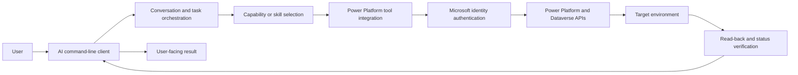
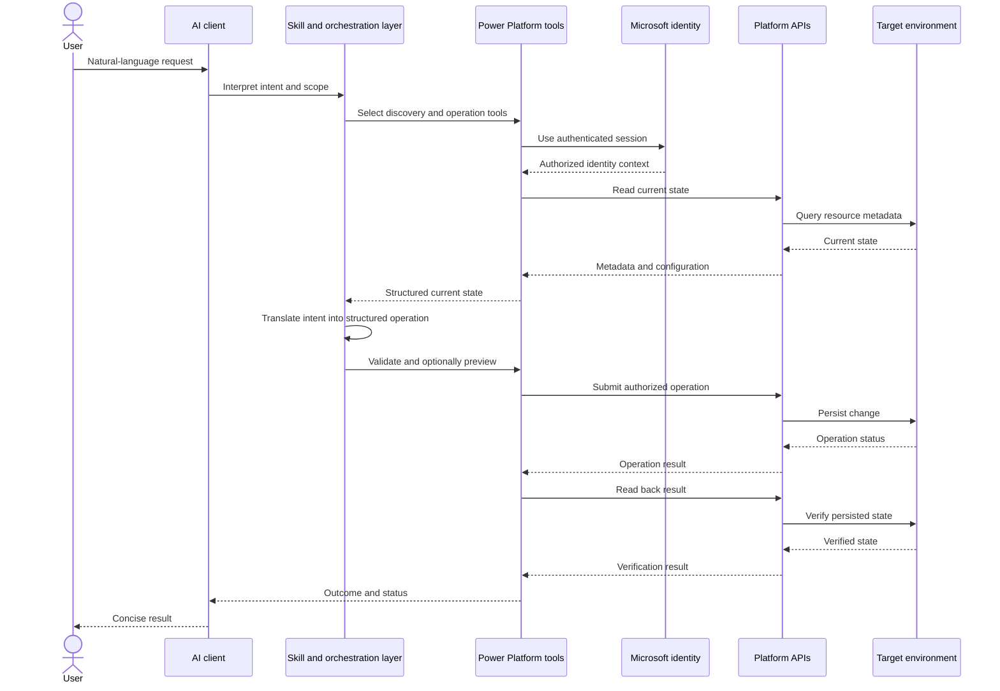
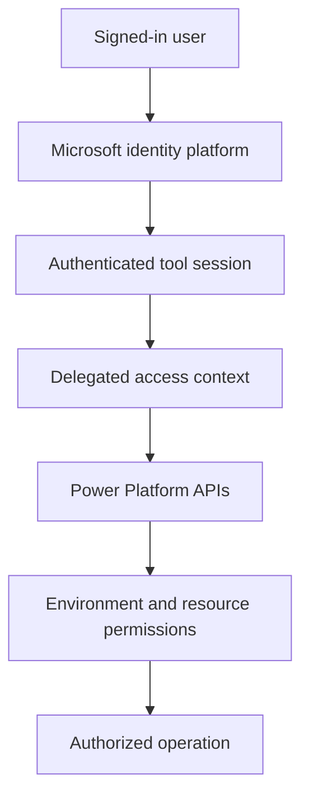
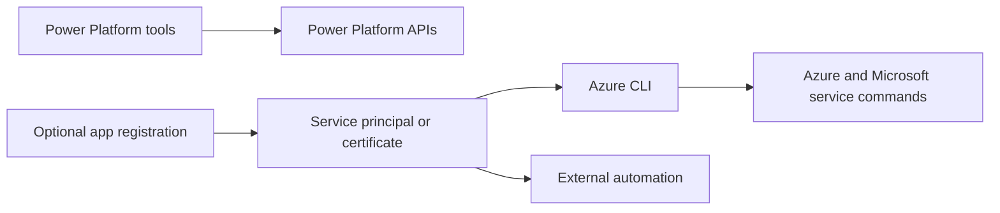
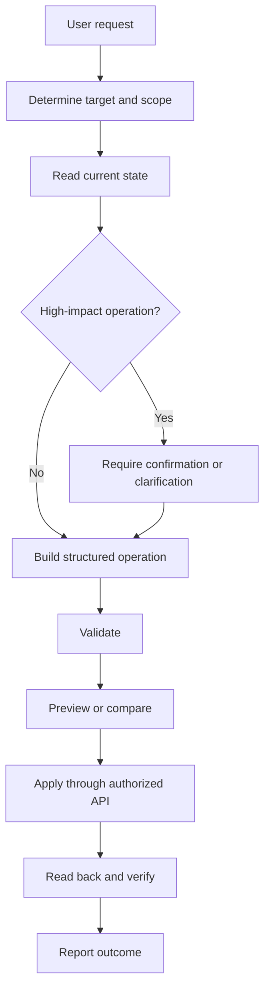
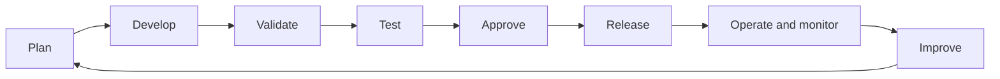

# AI and Power Platform Integration Architecture

This document explains how an AI assistant can communicate with Power Platform, authenticate, interpret user instructions, and apply authorized changes. It contains no application-specific examples, resource identifiers, business data, or flow details.

## Architecture overview

## What “Power Platform tools” means

Power Platform tools are an integration layer that exposes controlled operations for Microsoft Power Platform. Depending on the capability, the tools can:

- Discover environments and resources.
- Read metadata, definitions, and configuration.
- Resolve references and dependencies.
- Validate proposed changes.
- Preview differences before mutation.
- Create, update, publish, enable, disable, or test resources.
- Read back the result after an operation.

These tools are not the same as Azure CLI. They communicate with Power Platform services through supported Power Platform management and data APIs.

## How the AI communicates with Power Platform

## Instruction-to-operation lifecycle

The AI does not convert text directly into an unreviewed platform mutation. The request passes through these stages:

1. **Interpretation** — identify the requested outcome, target scope, inputs, dependencies, and risk.
2. **Discovery** — inspect the selected environment and current resource state.
3. **Mapping** — map the natural-language request to supported platform operations and schemas.
4. **Construction** — build a structured operation using exact parameter names and supported types.
5. **Validation** — check syntax, required fields, references, permissions, and platform constraints.
6. **Preview** — calculate or display the intended difference when the operation supports preview.
7. **Authorization** — perform the operation only within the signed-in identity’s permissions.
8. **Execution** — submit the operation through the Power Platform API layer.
9. **Verification** — read back the resource or operation status.
10. **Reporting** — tell the user what was completed, what was not completed, and any relevant limitation.

## Authentication and authorization

The integration uses the identity already authenticated in the tool environment. The identity supplies the authorization context used when calling Power Platform services.

Authentication and authorization are separate concepts:

- **Authentication** establishes who the caller is.
- **Authorization** determines what that caller may read or change.
- **Connector authentication** applies when a specific connector or external service requires its own connection.
- **Environment permissions** control access to the target Power Platform environment.
- **Dataverse security roles** control access to tables, rows, and operations.

Credentials, access tokens, client secrets, and certificates must not be written into prompts, source files, documentation, or solution contents.

## Azure CLI and Azure App Registration

Azure CLI is a separate command-line utility for Azure and Microsoft service administration. Its installation does not mean it was used for a particular Power Platform operation.

The components have different purposes:

| Component | Role |
| --- | --- |
| **AI client** | Interprets user intent and coordinates the task. |
| **Power Platform tools** | Perform supported Power Platform discovery and operations. |
| **Azure CLI** | Runs Azure CLI commands when explicitly used by an operator or automation. |
| **App registration** | Defines an application identity for independent automation. |
| **Service principal** | Represents the application identity when it runs without a user. |
| **Microsoft identity platform** | Authenticates users and applications and issues authorization tokens. |

An app registration is not automatically required for an authenticated interactive tool session. It is normally introduced when an organization needs unattended or repeatable automation, such as a deployment pipeline, scheduled job, integration service, or custom application. That setup requires explicit application permissions, environment access, Dataverse security roles, consent, and secret or certificate management.

The presence of Azure CLI on a workstation or agent may be due to a base development image, prerequisite package, or another workflow. It is not evidence that Azure CLI or an app registration participated in a specific operation.

## Safety and change controls

The control model favors narrow, reversible, and verifiable operations. It avoids blindly replacing unknown state, preserves unrelated configuration, surfaces errors, and requires additional confirmation for destructive or irreversible actions.

## Lifecycle and ALM boundary

The AI integration is an operational interface. It does not replace an organization’s application lifecycle management process. Repeatable delivery should still use the organization’s standards for source control, solution packaging, environment configuration, approvals, deployment pipelines, monitoring, rollback, and audit logging.

Interactive changes can be appropriate for controlled development or maintenance. Production delivery should generally use an approved deployment process with managed identity, documented configuration, access reviews, and traceable releases.

## Key boundaries

- The AI client coordinates work; it does not grant permissions.
- Power Platform tools call supported services; they do not bypass platform security.
- Microsoft identity authenticates the caller; resource permissions authorize actions.
- Azure CLI is independent unless explicitly invoked.
- An app registration is optional for interactive access but commonly required for unattended automation.
- Export and import are lifecycle mechanisms for moving packaged solutions between environments; they are not prerequisites for every direct authenticated operation.
- Verification is required to confirm that the requested operation was persisted successfully.
